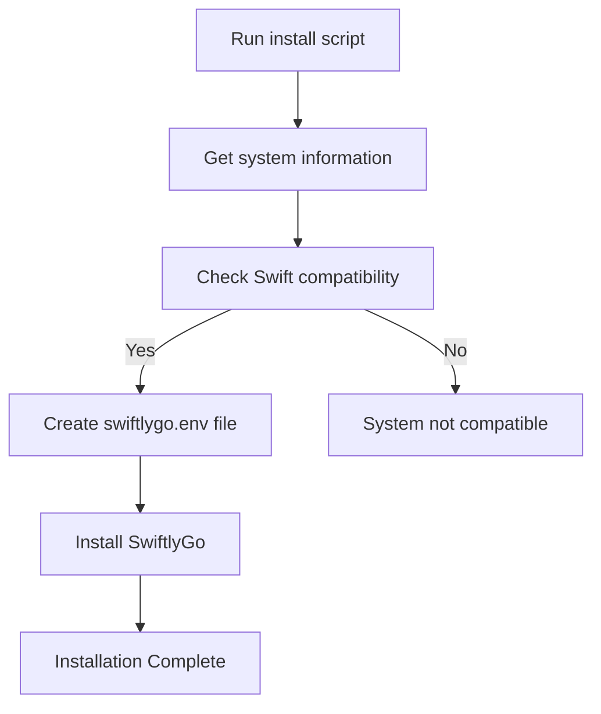
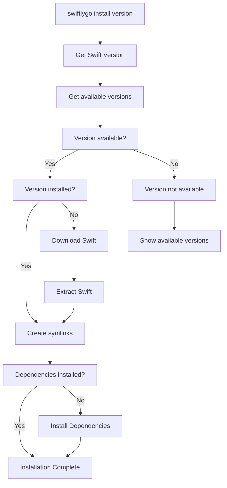
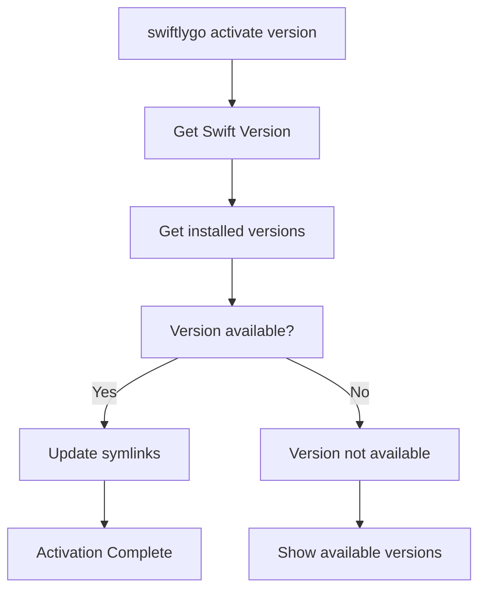
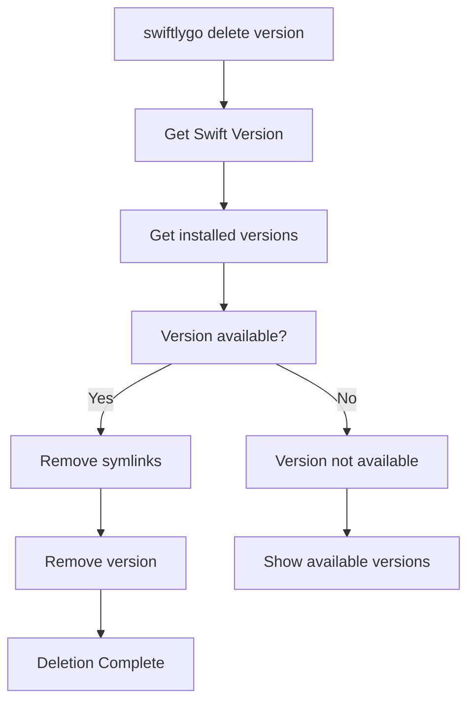

# SwiftlyGo Design Document
## SwiftlyGo Overview
#### Purpose
An Installer and Toolchain Manager for the Swift Programming Language on Linux.

Initially SwiftlyGo will be available for Debian / Ubuntu based distributions but can be easily extended to support other platforms.
#### Functions
* Check the host OS system for Swift compatibilty
* Detect the host Linux OS distribution and version
* Check Versions of Swift available for detected distribution
* Download and install Swift toolchains
* Install the system dependencies needed for Swift
* Activate and use different locally installed Swift versions
* Delete installed Swift toolchains
* Remove the SwiftlyGo app

#### Development Priorities
 
* Ease of development
* Portability
* Functionality
* Ease of distribution

When considering these priorities the decision was made to develop in the [Go](https://go.dev/) language and use the [Cobra Cli](https://pkg.go.dev/github.com/spf13/cobra) package.

#### Swift Toolchain Installation Location.
When choosing the installation location of the SwiftlyGo app and the Swift toolchains it was decided to use the standard installation location of `/usr/libexec/[name]/[version]/`.  
Each toolchain version is contained in its own directory.
```
/usr/libexec/swift
|-- 5.10.1
|   `-- usr
|       |-- bin
|       |-- include
|       |-- lib
|       |-- libexec
|       |-- local
|       `-- share
|-- 6.0
|   `-- usr
|       |-- bin
|       |-- include
|       |-- lib
|       |-- libexec
|       |-- local
|       `-- share
`-- 6.0.3
    `-- usr
        |-- bin
        |-- include
        |-- lib
        |-- libexec
        |-- local
        `-- share

```
The **SwiftlyGo** App is installed in the same location.
```
/usr/libexec/swiftlygo/
`-- bin
    |-- swiftlygo
    `-- swiftlygo.env
```
## SwiftlyGo Operational Flow Diagrams

### Installation of SwiftlyGo


### Installation of a Swift Toolchain


### Activation of a Swift Toolchain


### Deletion of a Swift Toolchain

